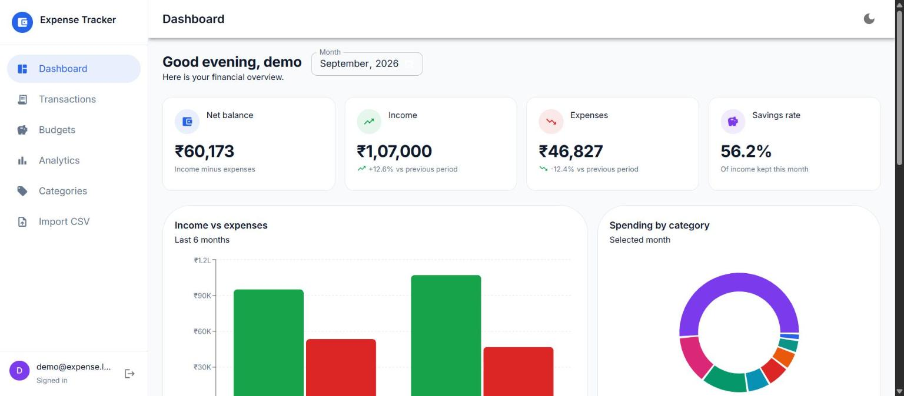
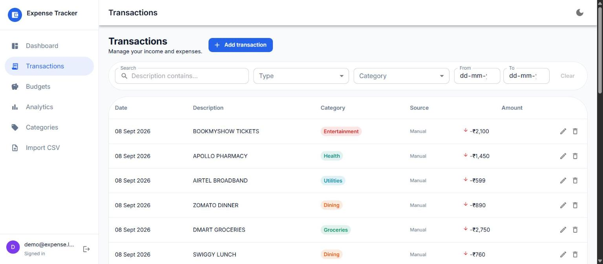
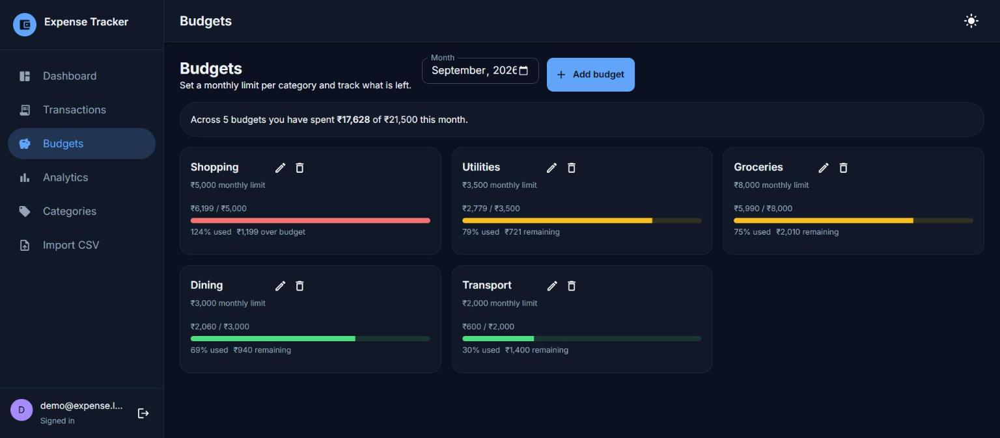

# Personal Expense Tracker

A full-stack personal finance dashboard: import a bank CSV, let keyword rules categorize it, set budgets,
and see where the money went. Java 21 / Spring Boot REST API with JWT auth and PostgreSQL, React + Material UI
frontend, all runnable with one `docker compose up`.



## Quick start

```bash
docker compose up --build
```

- App: <http://localhost:5173>
- API: <http://localhost:8080/api>

Register an account, add a few keyword rules on the **Categories** page (`big bazaar` → Groceries,
`uber` → Transport), then import [`sample-data/transactions.csv`](sample-data/transactions.csv) from the
**Import CSV** page and watch the dashboard fill in.

## What it does

| Feature | Detail |
| --- | --- |
| Multi-user auth | Register / login, BCrypt hashes, stateless JWT, every query scoped to the authenticated user |
| Income and expenses | Both tracked, with net balance and savings rate per month |
| Transactions | Server-side pagination, search, type / category / date-range filters, inline add-edit-delete |
| CSV import | Header mapping, several date formats, duplicate detection, per-row error reporting |
| Auto-categorization | Per-user keyword rules; the longest keyword found in a description wins |
| Budgets | Monthly limit per category with spent / remaining / percentage and semantic colour grading |
| Analytics | Category distribution, income vs expense, daily spend, per-category breakdown over any range |
| Dashboard | Stat cards with month-over-month trends, three charts, budget progress, recent transactions |

The import is the interesting part: it parses the whole file, imports every valid row, skips rows that
duplicate existing transactions, and returns a summary naming the line number and problem of each bad row —
one malformed line does not sink the upload.

## Interface

Responsive from 320px up: a persistent sidebar on desktop that becomes a drawer on mobile, tables that
turn into transaction cards on small screens, and charts that resize instead of shrinking to nothing.
Light and dark themes are separate palettes, not an inversion, and the choice is remembered per browser.
Amounts are formatted as Indian Rupees throughout (`₹1,25,000`) via a single `formatCurrency` utility.




## Stack

**Backend** — Java 21, Spring Boot 4, Spring Security + JJWT, Spring Data JPA / Hibernate, PostgreSQL 16,
Flyway migrations, Bean Validation, OpenCSV, Maven.

**Frontend** — React 19, Vite, Material UI 7, Recharts, Axios, React Router.

**Testing / ops** — JUnit 5 + MockMvc + Testcontainers (real Postgres, not H2), Vitest + React Testing
Library, GitHub Actions CI, multi-stage Docker builds, nginx serving the SPA and proxying `/api`.

## API

All endpoints except `/api/auth/**` need `Authorization: Bearer <token>`.

| Method | Path | Purpose |
| --- | --- | --- |
| POST | `/api/auth/register`, `/api/auth/login` | Get a JWT |
| GET | `/api/expenses?from&to&kind&categoryId&q&page&size` | Paged, filtered transactions |
| POST / PUT / DELETE | `/api/expenses[/{id}]` | Create, update, delete (`kind` = `EXPENSE` or `INCOME`) |
| POST | `/api/expenses/import` | Multipart CSV upload, returns an import summary |
| GET / POST / DELETE | `/api/categories[/{id}]` | Categories (built-ins are shared, read-only) |
| GET / POST / DELETE | `/api/categories/rules[/{id}]` | Auto-categorization keyword rules |
| GET / POST / PUT / DELETE | `/api/budgets[/{id}]?month=YYYY-MM` | Budgets with spend measured against the limit |
| GET | `/api/reports/summary`, `/by-category`, `/monthly`, `/daily` | Dashboard and analytics aggregates |

## Architecture

```
React SPA ──HTTP/JSON──▶ Spring Boot API ──JDBC──▶ PostgreSQL
   (nginx)                JwtAuthFilter               (Flyway-managed schema)
                          feature packages:
                          auth · expense · category · budget · importer · report
```

Aggregation happens in SQL, not in Java streams. Money is `BigDecimal(12,2)` end to end. The schema is
owned by Flyway migrations with Hibernate set to `validate`, so the entities and the database can never
quietly drift apart. On the frontend, colours live in one theme file and currency formatting in one utility.

## Development

Backend (needs a Postgres — `docker compose up -d db` gives you one on port 5433):

```bash
cd backend
./mvnw spring-boot:run     # http://localhost:8080
./mvnw verify              # tests, needs Docker for Testcontainers
```

Frontend:

```bash
cd frontend
npm install
npm run dev                # http://localhost:5173, talks to VITE_API_URL
npm test
```

`SERVER_PORT`, `DB_URL`, `DB_USER`, `DB_PASSWORD`, `JWT_SECRET`, `JWT_TTL_HOURS` and `CORS_ORIGINS`
are all environment-overridable; the defaults in `application.yml` are for local development only.
Set a real `JWT_SECRET` (32+ bytes) anywhere else.

## Deployment

The backend image is a plain `java -jar` container, so it deploys to Render / Fly / Railway from
`backend/Dockerfile` with `DB_URL` + `JWT_SECRET` set. The frontend is static output; build it with
`npm run build` and host `dist/` anywhere, or use `frontend/Dockerfile` for the nginx image that also
proxies `/api` to the backend.
